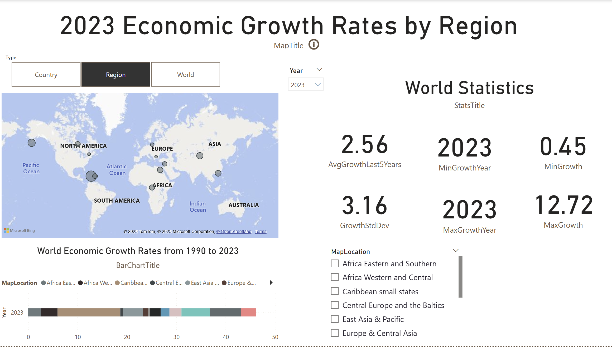

# 🌍 Power BI Project: Economic Growth Dashboard (1990–2023)

This interactive Power BI dashboard visualizes **global economic growth rates by region** from **1990 to 2023** using map and bar chart visuals. It helps users explore growth trends, key statistics, and regional comparisons across the globe.

---

## 📊 Key Features

- 🗺️ **Map Visualization** — View economic growth by continent/region
- 📈 **Bar Chart Timeline** — Track changes over time (1990–2023)
- 📌 **Country/Region/World Toggle** — Switch between different data scopes
- 📊 **Summary Statistics** — See average, min, max growth per year

---

## 📂 Files Included

| File | Description |
|------|-------------|
| `EconomicGrowthDashboard.pbix` | Power BI dashboard file |
| `EconomicGrowthData.xlsx` | Source dataset used in the dashboard |
| `dashboard-preview.png` | Screenshot preview of the dashboard |

---

## 🚀 How to Use

1. **Download** all files in this folder
2. Open `EconomicGrowthDashboard.pbix` in [Power BI Desktop](https://powerbi.microsoft.com/desktop)
3. If prompted, reconnect to `EconomicGrowthData.xlsx` as the data source
4. Interact with the dashboard to explore growth trends by region or time

---

## 🔗 Optional: Online Version

> If published to Power BI Service, include your public link here:

**[🌐 View Online Report](https://app.powerbi.com/view?r=your-report-id)**  
(*Note: this will only work if published via "Publish to web" option in Power BI Service.*)

---

## 🧠 Tools & Skills Used

- Power BI Desktop
- Excel
- Data Modeling
- Map and Filled Map Visuals
- Data Visualization & Storytelling

---

## 📌 Author

**Nghia Ha (NghiaHa1995)**  
GitHub: [@Nghiaha](https://github.com/Nghiaha1995)

---

> 📁 Project folder: `powerbi-project/powerbi-economic-growth`

